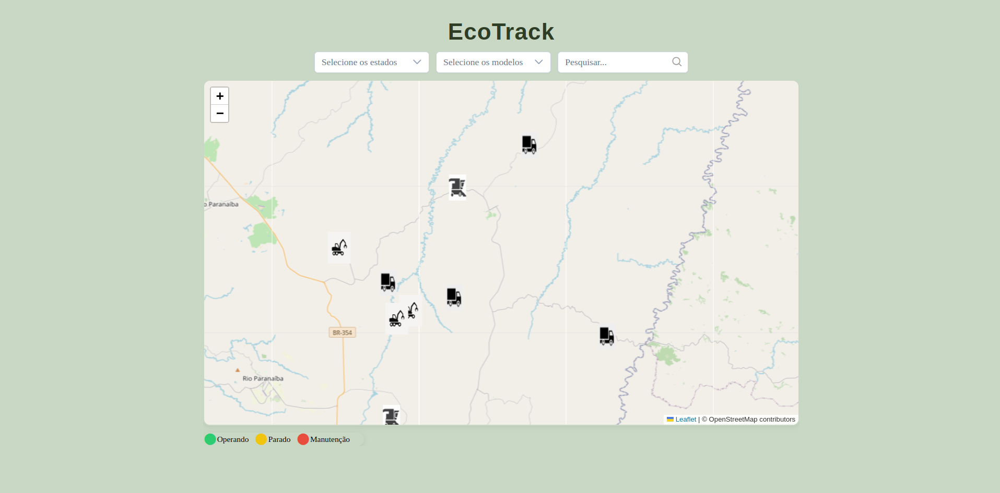

# EcoTrack

## 🚀 Começando

Antes de utilizar o projeto, é necessário ter Git e npm/yarn instalado na máquina.

## 📃 Sobre

  <p>
   Você é o desenvolvedor frontend de uma empresa que coleta dados de equipamentos utilizados em uma operação florestal. Dentre esses dados estão o histórico de posições e estados desses equipamentos. O estado de um equipamento é utilizado para saber o que o equipamento estava fazendo em um determinado momento, seja Operando, Parado ou em Manutenção. O estado é alterado de acordo com o uso do equipamento na operação, já a posição do equipamento é coletada através do GPS e é enviada e armazenada de tempo em tempo pela aplicação.

O objetivo é, de posse desses dados, desenvolver o frontend de aplicação web que trate e exibida essas informações para os gestores da operação.

  </p>

## 🛠️ Ferramentas

## - Front-End:

- Vue
- Typescript
- Vite
- Pré-processadores SCSS.
- PrimeVue
- Leaflet
- Linter

## ⚙️ Como executar

1 - Clone o repositório em uma pasta de sua preferencia

```
git@github.com:AiramToscano/teste-frontend-v4-AiramToscano.git
```

2 - Instale as dependencias com yarn

```
yarn add / npm i
```

3 - Será necessário configurar a porta no .env

```
VITE_APP_PORT=8001
```

4 - Rode yarn dev e yarn css

```
yarn dev
```

```
yarn css
```

## ✅ Funcionalidades Implementadas

- 📍 **Integração com o Mapa (Leaflet)**  
  Visualização interativa da localização dos equipamentos, com marcadores customizados e centralização automática.

- 🗂️ **Histórico de Estados dos Equipamentos**  
  Exibição de estados com datas e nomes, utilizando cores dinâmicas para facilitar a identificação de situações como _Operando_, _Parado_ ou _Em Manutenção_.

- 🔍 **Filtros Avançados**

  - Filtro por **estado** (multi-select)
  - Filtro por **modelo de equipamento** (multi-select)
  - Campo de busca por **nome do equipamento**

- 💬 **Popups Informativos**  
  Ao clicar nos marcadores, uma janela exibe as principais informações do equipamento, incluindo nome e status atual.

- 🎨 **Design Responsivo e Temático**  
  Estilo visual inspirado em tons florestais, com destaque para o mapa e informações de forma clara e acessível.

# Front-End EcoTrack



# 🎁 Expressões de gratidão

- Gostaria de agradecer a Aiko por esse desafio, aprendi muito com esse projeto, a cada um novo desafio se torna um novo aprendizado.
